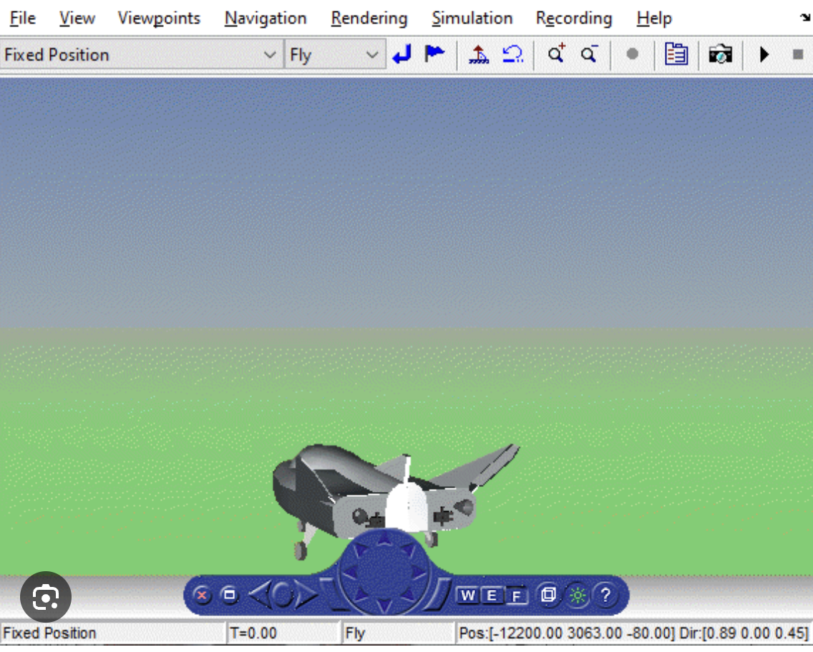

# RCAM-RealTime-FlightSim-Visualization 🚀

### Real-Time Flight Simulation with Variable Mass and Visualization

This project visualizes the **RCAM (Research Civil Aircraft Model)** in a **real-time flight simulation** with **keyboard-based control** and **variable mass implementation**. The simulation aims to analyze flight dynamics while incorporating mass changes, useful for scenarios such as **fuel tank drops** or **payload releases**.

---

## ✈️ Features

- **Real-Time Keyboard-Based Control**  
- **Variable Mass Implementation** (simulating fuel drop effect)  
- **Live Aircraft Visualization** using **NASA HL-20 Model visualization block**  
- **Simulink Model with 4 Scopes** (Inputs, States, Position, Geocentric Coordinates)  
- **Future Expandability** (X-Plane / FlightGear integration)

---

## 🕹️ Keyboard Controls

A custom MATLAB function (`keyboard_control_live`) captures **real-time keyboard inputs** and converts them into a **6-element control vector**.

| Key  | Control |
|------|---------|
| ⬆️⬇️ Left/Right | **Aileron (dA) & Elevator (dT)** |
| A / D | **Rudder (dR)** |
| W / S | **Throttle (dth1, dth2)** |
| Space | **Toggle Mass Drop (u6)** |

Each control input updates dynamically as `u_dynamic = u0 + control_input`, where `u0` represents the trim control inputs.

---

## 🛠️ Variable Mass Implementation

The **RCAM model** was **modified** to include a **mass variation** feature. The **sixth control input (`u6`)** acts as a toggle for mass reduction:

- **`u6 = 0`** → **m = 120,000 kg** (Initial mass)
- **`u6 = 1`** → **m = 90,000 kg** (Reduced mass)

This **simulates a fuel tank drop** without affecting the **aircraft’s aerodynamics** or **center of gravity** (assuming the dropped weight is aligned with the CG). The mass reduction allows analysis of performance changes due to weight loss.

---

## 🎥 Visualization & Scopes

The aircraft’s motion was **visualized** using the **NASA HL-20 Model visualization block**. Additionally, **four Simulink scopes** were implemented to monitor aircraft behavior:

- **Control Inputs Over Time**: Tracks variations in **dA, dT, dR, dth1, dth2, u6**  
- **State Variables (9 States)**: **u, v, w, p, q, r, ϕ, θ, ψ**  
- **Position (NED Frame)**: Monitors **PN, PE, PD**  
- **Geocentric Coordinate Evolution**: Tracks **Latitude, Longitude, and Altitude**, enabling potential **X-Plane or FlightGear integration**

---

## 🏁 Trim Initialization

The aircraft was initialized in **level flight at 85 m/s**, with predefined **trim values** for stability using trim optimization:

### **State Vector (`X0`)** **[12×1]**

X0 = [84.99, 0.00, 1.27, 0.00, 0.00, 0.00, 0.00, 0.015, 0.00, -12000, -1000, -500]

### **Control Vector (`U0`)** **[6×1]**

U0 = [0.0000, -0.1780, 0.0000, 0.0821, 0.0821, 0]

(Aileron, Elevator, Rudder, Throttle 1, Throttle 2, Weight Drop)

---

## 📌 Execution Process

1. **Initialize Aircraft:** Set **trim conditions** for velocity, angles, and controls.
2. **Assign Variables to Workspace:** `X0` and `U0` are **stored in MATLAB workspace**.
3. **Start Keyboard Control:** The function **`keyboard_control_live()`** captures **user inputs dynamically**.
4. **Run Simulink Model:** The **RCAM nonlinear model** is executed **in real-time**.
5. **Monitor Outputs:** **Visualization and scopes** display aircraft response.

---

## 🔍 Understanding the RCAM Model

The **Research Civil Aircraft Model (RCAM)** is a **nonlinear 6-DOF aircraft dynamics model** used for flight control and stability analysis. The model includes:

- **Aerodynamic Forces & Moments** (Lift, Drag, Side Force)
- **Control Inputs** (Aileron, Elevator, Rudder, Throttle)
- **Engine Model** (Thrust forces)
- **Gravity & Mass Effects**
- **Navigation Equations** (Converting body velocities to global frame)

The **Simulink model** is modified to **accept 6 inputs instead of 5**, where the additional input **controls mass reduction**.

---

## 📊 Results & Conclusion

This project **successfully integrates**:

✅ **Real-time keyboard-based manual aircraft handling**  
✅ **Variable mass simulation**, demonstrating mass reduction effects  
✅ **Advanced visualization** using **MATLAB Aerospace Blockset**  

### 🔮 Future Improvements:
- **Integrate with X-Plane or FlightGear** for external visualization  
- **Expand control inputs** (e.g., shift center of gravity, landing gear deployment)  
- **Implement fuel consumption-based mass reduction over time**  

---

## 📷 Screenshots

### **Simulink Model Used for Simulation**

### **Control Inputs and 12 State Variables vs. Time**

### **Geocentric Coordinates and NED Positions vs. Time**

### **Visualization of HL-20 Vehicle Simulation**

---
